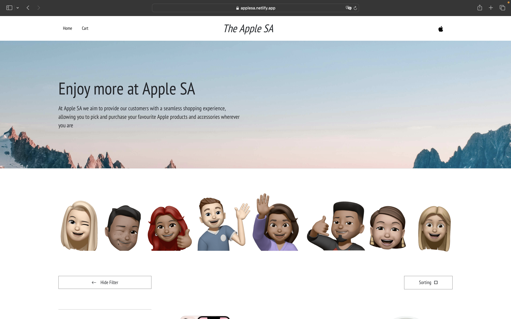

#### Shopping Cart

###### Date Started: 02/23/2024

###### Last Updated: 06/12/2024

###### Deployment: Netlify

---

###### Tech Stack: Bootstrap, HTML5 & CSS, JavaScript

---

Welcome to Shopping Cart! If you're here, you're checking out how to make your own simple shopping cart and you can rest assured that you have come to the right place. Feel free to explore, and remember, the code is yours to adapt and use however you like. Enjoy!

---

---

###### Features:

- Responsive design that adapts to different screen sizes.
- Store to buy exclusive Apple products.
- External CSS file for styling.

---

###### Process:

- Started with a basic Bootstrap template.
- Removed excessive HTML.
- Filled out each section with relevant information and structured them properly.
- Styled the webpage using an external CSS file.
- Added JavaScript functionality for the shopping cart.

---

###### Learnings:

- Gained a deeper understanding of HTML5 and CSS.
- Learned how to structure a webpage semantically.
- Improved skills in responsive web design.
- Gained experience in presenting personal information in a professional manner.
- Learned to implement dynamic functionality using JavaScript for adding, removing, and updating cart items.
